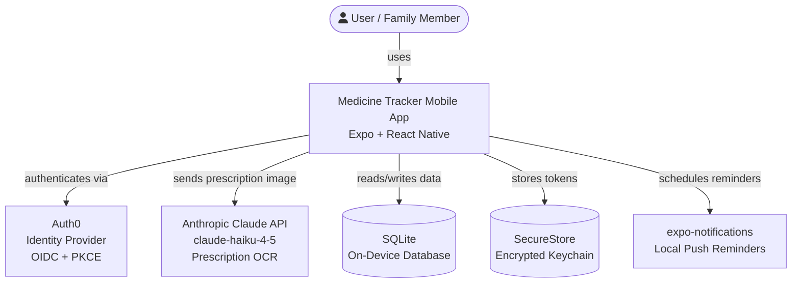
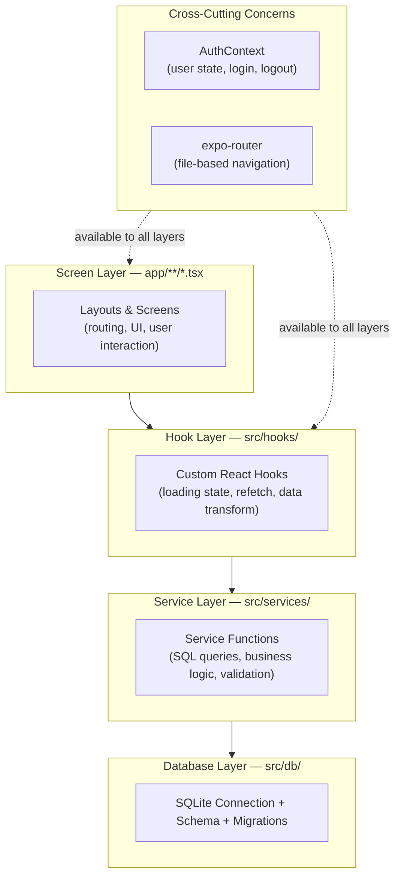
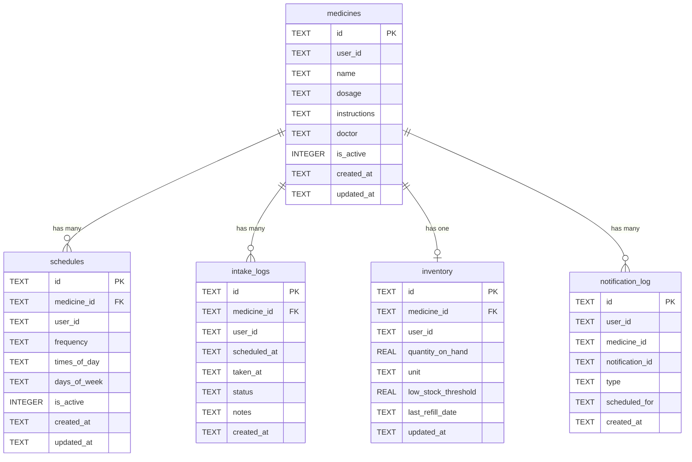
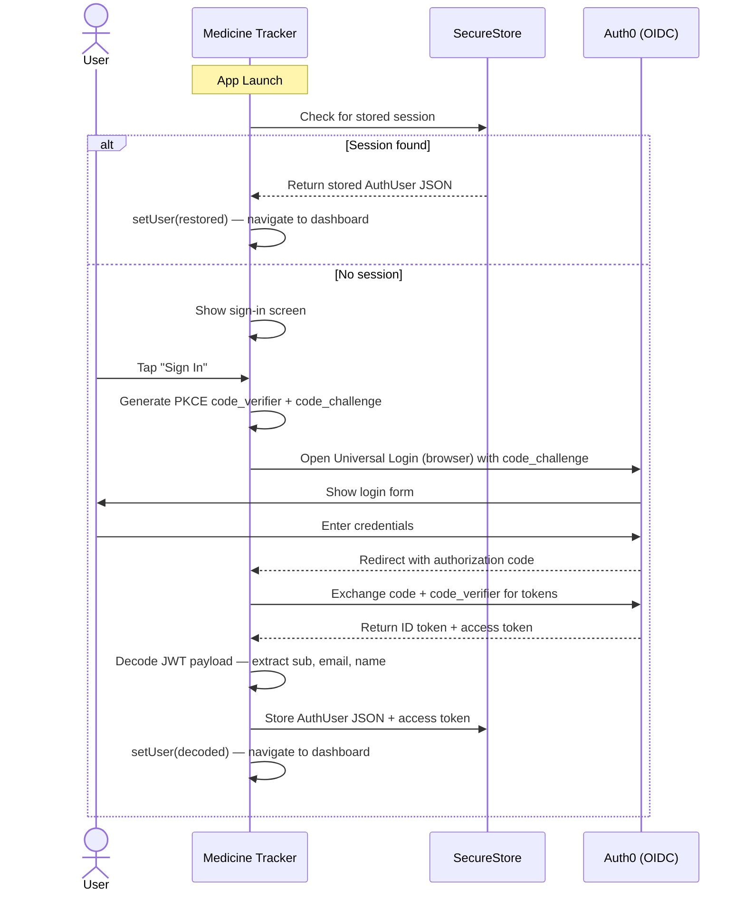
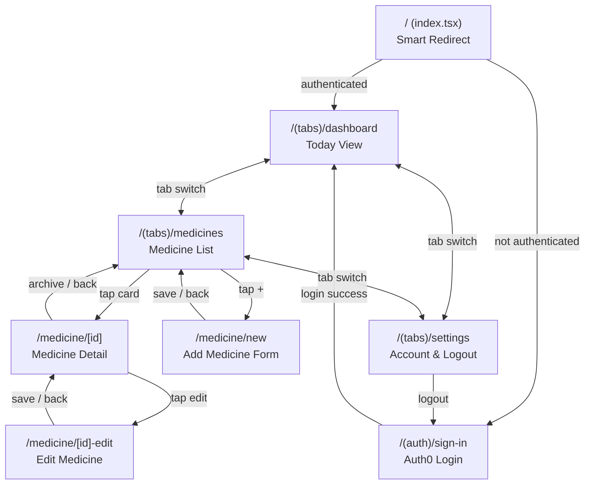

# Medicine Tracker — Architecture Document

## Document Control

| Version | Date | Author | Changes |
|---------|------|--------|---------|
| 1.0 | 2026-03-08 | Principal Architect | Initial draft covering Phases 1–4 (scaffold, database, auth, medicine CRUD). Planned architecture for Phases 5–9. |
| 2.0 | 2026-03-09 | Principal Architect | All 9 phases shipped. Updated executive summary, hook/service tables, file tree, tech debt register, and future evolution section to reflect current codebase state. |

**Status:** Living document — updated as each phase is implemented.
**Audience:** Engineers, architects, technical leads, and anyone beginning spec-driven development on this codebase.
**Diagram source:** [architecture-diagram.mmd](./architecture-diagram.mmd)

---

## 1. Executive Summary

Medicine Tracker is a **mobile-first, offline-first** family medicine management app built with Expo SDK 55 and React Native. All user data is stored locally on-device via SQLite — there is no backend server and no cloud sync. Authentication is delegated to Auth0 via OIDC with PKCE. The app follows a strict four-layer architecture (**Screens → Hooks → Services → Database**) with a non-negotiable security invariant: every database query is scoped to the authenticated user's `user_id`.

**Current state (v1.0):** All 9 phases are complete. The app ships with: project scaffold, SQLite database with full schema (5 tables), Auth0 OIDC authentication with session persistence, medicine CRUD UI, OCR prescription scanning via Claude API (claude-haiku-4-5), inventory tracking with low-stock alerts, dosage schedules (daily / twice-daily / weekly / as-needed / custom), intake logging with adherence statistics, and local push notifications for dose reminders and low-stock events.

---

## 2. Design Philosophy & Principles

| Principle | Rationale |
|-----------|-----------|
| **Offline-first** | All data lives on-device via SQLite. The app works without internet except for login (Auth0) and OCR (Claude API). No sync, no backend, no data leaves the device unless the user explicitly scans a prescription. |
| **Privacy by default** | Each user's data is scoped by `user_id` (Auth0 `sub`). No cross-user data access is possible at the query level. Tokens are stored in the OS encrypted keychain (SecureStore). |
| **Layered separation** | Screens never touch the database directly. All data access flows through Services. Hooks bridge Services to the React render cycle. This makes each layer independently testable and replaceable. |
| **Strict TypeScript** | `strict: true` in `tsconfig.json`. No `any` types — use `unknown` and narrow with type guards. TypeScript interfaces in `schema.ts` mirror every database table. |
| **Convention over configuration** | File-based routing (expo-router), kebab-case file names, PascalCase component names, `@/` import alias for `src/`. New files follow established patterns without configuration. |
| **Explainability** | Every file contains inline comments explaining "what" and "why" in language accessible to non-developers. This is an intentional design choice for a learning-oriented codebase. |

---

## 3. System Context

The diagram below shows the system boundary and all external integrations.



**Key architectural decision:** There is no backend server. The mobile app communicates directly with Auth0 (for identity) and the Claude API (for OCR). All medicine data, schedules, and logs live exclusively in the on-device SQLite database. This eliminates server costs, latency, and data privacy concerns at the expense of multi-device sync (a deliberate trade-off for v1).

---

## 4. Layered Architecture



### 4.1 Screen Layer (`app/`)

**Responsibility:** UI rendering, user interaction, navigation. Screens consume data from hooks and dispatch mutations to services.

| Route | File | Purpose |
|-------|------|---------|
| `/` | `app/index.tsx` | Smart redirect — authenticated users → dashboard, others → sign-in |
| `/(auth)/sign-in` | `app/(auth)/sign-in.tsx` | Auth0 login screen with branding |
| `/(tabs)/dashboard` | `app/(tabs)/dashboard.tsx` | Today view — dose tracking, adherence stats, low-stock alerts |
| `/(tabs)/medicines` | `app/(tabs)/medicines.tsx` | Medicine list with inventory badges, pull-to-refresh, empty state |
| `/(tabs)/settings` | `app/(tabs)/settings.tsx` | Account info, notification permission status, sign-out |
| `/medicine/new` | `app/medicine/new.tsx` | Add medicine form — manual entry or OCR camera scan |
| `/medicine/[id]` | `app/medicine/[id].tsx` | Medicine detail: inventory section, schedule section, adherence stats, edit/archive |
| `/medicine/[id]-edit` | `app/medicine/[id]-edit.tsx` | Pre-filled edit form for existing medicine |

**Layout files:**
- `app/_layout.tsx` — Root layout: runs migrations synchronously at module load, wraps app in `<AuthProvider>`, requests notification permission once on launch, sets up Stack navigator.
- `app/(auth)/_layout.tsx` — Route group layout for unauthenticated screens.
- `app/(tabs)/_layout.tsx` — Bottom tab bar with 3 tabs (Today, Medicines, Settings).

### 4.2 Hook Layer (`src/hooks/`)

**Responsibility:** Bridge between screens and services. Manages loading state, data fetching, and provides a `refetch()` function for post-mutation refresh.

**Convention:** Every hook returns `{ data, isLoading, refetch }` plus mutation helpers specific to the domain.

| Hook | Status | Service(s) Called |
|------|--------|------------------|
| `useMedicines` | Built | `getMedicines`, `addMedicine`, `archiveMedicine` |
| `useSchedule` | Built | `getSchedule`, `upsertSchedule`, `deactivateSchedule` |
| `useInventory` | Built | `getInventory`, `upsertInventory`, `recordRefill` |

> **Note:** Intake logging and adherence are called directly from `dashboard.tsx` (via `useFocusEffect`) rather than through dedicated hooks, because dose state changes on every Take/Skip interaction and needs immediate UI response.

### 4.3 Service Layer (`src/services/`)

**Responsibility:** All database read/write logic. Pure functions with no React dependencies. Independently testable.

**Signature convention:** Every function follows `fn(db: SQLiteDatabase, userId: string, ...args)`. The `userId` parameter is the Auth0 `sub` and is included in every SQL `WHERE` clause. This is the **primary security invariant** of the system.

| Service | Status | Key Functions |
|---------|--------|--------------|
| `medicine.service.ts` | Built | `addMedicine`, `getMedicines`, `getMedicineById`, `updateMedicine`, `archiveMedicine` |
| `medicine.service.test.ts` | Built | 15 unit tests covering all CRUD + user-scoping security |
| `ocr.service.ts` | Built | `scanPrescription(imageBase64, mimeType)` → `AddMedicineInput`; error classes: `NetworkError`, `APIError`, `ParseError` |
| `inventory.service.ts` | Built | `getInventory`, `getAllInventories`, `getLowStockInventories`, `upsertInventory`, `recordRefill` |
| `schedule.service.ts` | Built | `getSchedule`, `upsertSchedule`, `deactivateSchedule`; frequency types: `daily`, `twice_daily`, `weekly`, `as_needed`, `custom` |
| `intake.service.ts` | Built | `generateTodaysDoses`, `getTodaysDoses`, `markTaken`, `markSkipped`, `getAdherenceStats`, `getOverallAdherence` |
| `notification.service.ts` | Built | `requestPermission`, `getPermissionStatus`, `scheduleDoseNotifications`, `cancelDoseNotification`, `cancelMedicineNotifications`, `checkAndNotifyLowStock`, `rescheduleAllNotifications` |

### 4.4 Database Layer (`src/db/`)

| File | Purpose |
|------|---------|
| `client.ts` | Opens the SQLite connection via `openDatabaseSync("medicine-tracker.db")`. Exports a singleton `db` object used by all services. |
| `schema.ts` | TypeScript interfaces mirroring every database table. Source of truth for types across the codebase. |
| `migrations.ts` | `runMigrations(db)` — executes `CREATE TABLE IF NOT EXISTS` for all 5 tables. Called synchronously at module load time in `app/_layout.tsx` to guarantee tables exist before first render. Idempotent. |

**Design decision:** Migrations run synchronously at module load (not in `useEffect`) because the database must be ready before any screen renders. This prevents race conditions where a screen queries a table that doesn't exist yet.

---

## 5. Data Model

### 5.1 Entity-Relationship Diagram



### 5.2 Table Definitions

#### `medicines` — Core prescription table
| Column | Type | Constraints | Description | Example |
|--------|------|-------------|-------------|---------|
| `id` | TEXT | PRIMARY KEY | App-generated unique ID | `"k7x2mq-lk9f4s0"` |
| `user_id` | TEXT | NOT NULL | Auth0 `sub` — scopes data to user | `"auth0\|abc123"` |
| `name` | TEXT | NOT NULL | Medicine name | `"Lisinopril"` |
| `dosage` | TEXT | NOT NULL | Dosage string | `"10mg"` |
| `instructions` | TEXT | nullable | Usage instructions | `"Take with food"` |
| `doctor` | TEXT | nullable | Prescribing doctor | `"Dr. Smith"` |
| `is_active` | INTEGER | NOT NULL, DEFAULT 1 | Soft-delete flag (1=active, 0=archived) | `1` |
| `created_at` | TEXT | NOT NULL | ISO 8601 creation timestamp | `"2026-03-08T12:00:00.000Z"` |
| `updated_at` | TEXT | NOT NULL | ISO 8601 last-modified timestamp | `"2026-03-08T12:00:00.000Z"` |

#### `schedules` — Dosage timing (Phase 7)
| Column | Type | Constraints | Description | Example |
|--------|------|-------------|-------------|---------|
| `id` | TEXT | PRIMARY KEY | Unique ID | `"abc-123"` |
| `medicine_id` | TEXT | NOT NULL, FK → medicines(id) ON DELETE CASCADE | Parent medicine | `"k7x2mq-lk9f4s0"` |
| `user_id` | TEXT | NOT NULL | Auth0 `sub` | `"auth0\|abc123"` |
| `frequency` | TEXT | NOT NULL | `"daily"`, `"twice_daily"`, `"weekly"`, `"as_needed"` | `"twice_daily"` |
| `times_of_day` | TEXT | NOT NULL | JSON array of HH:MM times | `'["08:00","20:00"]'` |
| `days_of_week` | TEXT | nullable | JSON array of day names; null = every day | `'["mon","wed","fri"]'` |
| `is_active` | INTEGER | NOT NULL, DEFAULT 1 | Soft-delete flag | `1` |
| `created_at` | TEXT | NOT NULL | ISO 8601 | — |
| `updated_at` | TEXT | NOT NULL | ISO 8601 | — |

#### `intake_logs` — Dose history (Phase 8)
| Column | Type | Constraints | Description | Example |
|--------|------|-------------|-------------|---------|
| `id` | TEXT | PRIMARY KEY | Unique ID | — |
| `medicine_id` | TEXT | NOT NULL, FK → medicines(id) ON DELETE CASCADE | Parent medicine | — |
| `user_id` | TEXT | NOT NULL | Auth0 `sub` | — |
| `scheduled_at` | TEXT | NOT NULL | When the dose was due | `"2026-03-08T08:00:00.000Z"` |
| `taken_at` | TEXT | nullable | When actually taken; null = not yet | `"2026-03-08T08:12:00.000Z"` |
| `status` | TEXT | NOT NULL, DEFAULT `'pending'` | `"taken"`, `"skipped"`, or `"pending"` | `"taken"` |
| `notes` | TEXT | nullable | User note (e.g., "felt nauseous") | — |
| `created_at` | TEXT | NOT NULL | ISO 8601 | — |

#### `inventory` — Stock tracking (Phase 6)
| Column | Type | Constraints | Description | Example |
|--------|------|-------------|-------------|---------|
| `id` | TEXT | PRIMARY KEY | Unique ID | — |
| `medicine_id` | TEXT | NOT NULL, UNIQUE, FK → medicines(id) ON DELETE CASCADE | One inventory row per medicine | — |
| `user_id` | TEXT | NOT NULL | Auth0 `sub` | — |
| `quantity_on_hand` | REAL | NOT NULL, DEFAULT 0 | Current count (supports decimals) | `28.0` |
| `unit` | TEXT | NOT NULL, DEFAULT `'tablet'` | Unit of measure | `"tablet"`, `"ml"`, `"capsule"` |
| `low_stock_threshold` | REAL | NOT NULL, DEFAULT 7 | Warn when quantity drops to this level | `7.0` |
| `last_refill_date` | TEXT | nullable | ISO 8601 of last refill | — |
| `updated_at` | TEXT | NOT NULL | ISO 8601 | — |

#### `notification_log` — Scheduled reminders (Phase 9)
| Column | Type | Constraints | Description | Example |
|--------|------|-------------|-------------|---------|
| `id` | TEXT | PRIMARY KEY | Unique ID | — |
| `user_id` | TEXT | NOT NULL | Auth0 `sub` | — |
| `medicine_id` | TEXT | NOT NULL | Related medicine | — |
| `notification_id` | TEXT | NOT NULL | ID from expo-notifications (for cancellation) | `"expo-notif-abc123"` |
| `type` | TEXT | NOT NULL | `"dose_reminder"` or `"low_stock"` | `"dose_reminder"` |
| `scheduled_for` | TEXT | NOT NULL | ISO 8601 when notification fires | — |
| `created_at` | TEXT | NOT NULL | ISO 8601 | — |

### 5.3 Indexing Strategy

| Index | Columns | Purpose |
|-------|---------|---------|
| `idx_medicines_user` | `(user_id, is_active)` | Fast lookup: "all active medicines for this user" |
| `idx_schedules_medicine` | `(medicine_id, is_active)` | Fast lookup: "active schedules for this medicine" |
| `idx_intake_user_date` | `(user_id, scheduled_at, status)` | Dashboard query: "today's pending doses for this user" |
| `idx_notif_user` | `(user_id, medicine_id)` | Cancel notifications: "all reminders for this medicine" |

### 5.4 ID Generation

```typescript
function generateId(): string {
  const random = Math.random().toString(36).slice(2, 8); // e.g., "k7x2mq"
  const timestamp = Date.now().toString(36);              // e.g., "lk9f4s0"
  return `${random}-${timestamp}`;
}
```

**Trade-off:** This is not a UUID and not cryptographically strong. It is adequate for a single-device, single-user scenario where collision probability is negligible. If multi-device sync is ever introduced, this must be replaced with UUID v4 or a server-assigned ID.

---

## 6. Authentication & Security Architecture

### 6.1 Auth Flow



**Key files:**
- `src/auth/auth0-config.ts` — Auth0 domain, client ID, scopes
- `src/auth/AuthContext.tsx` — Full OIDC+PKCE implementation, session restore, JWT decode

### 6.2 Security Controls

| Control | Implementation | File |
|---------|---------------|------|
| **PKCE authentication** | No client secret stored in app binary. Code verifier proves ownership. | `AuthContext.tsx` |
| **Parameterized SQL** | All user inputs use `?` placeholders. Never string-interpolated. | `medicine.service.ts` |
| **User-scoped queries** | Every `WHERE` clause includes `user_id = ?`. Enforced by service function signatures. | All service files |
| **Encrypted token storage** | iOS Keychain / Android EncryptedSharedPreferences via expo-secure-store. | `AuthContext.tsx` |
| **Soft delete** | Archived medicines set `is_active = 0`. No data destruction. Preserves audit trail. | `medicine.service.ts` |
| **Foreign key cascading** | `PRAGMA foreign_keys = ON`. Deleting a medicine cascades to schedules, logs, inventory. | `migrations.ts` |

### 6.3 Threat Model

| Threat | Severity | Mitigation | Status |
|--------|----------|------------|--------|
| API key in app binary (`EXPO_PUBLIC_ANTHROPIC_API_KEY`) | High | Use a backend proxy in production. Acceptable for dev/learning. | Known — mitigate before production |
| Cross-user data access | Critical | Mandatory `user_id` filter in every service function. | Mitigated |
| SQL injection | Critical | Parameterized queries with `?` placeholders. | Mitigated |
| Token theft from device | Medium | SecureStore uses OS-level encryption. | Mitigated |
| Auth0 token expiry without refresh | Medium | Implement token refresh flow in AuthContext. | Planned |
| Deep link bypassing auth guard | Low | Auth guard only in `index.tsx`. Add route-level guard to `(tabs)` layout. | Known |

---

## 7. Navigation & Routing Architecture

### 7.1 Route Map



### 7.2 Route Groups and Layouts

| Group | Navigator | Purpose |
|-------|-----------|---------|
| Root (`app/_layout.tsx`) | Stack | Wraps everything in `<AuthProvider>`. Runs migrations. |
| `(auth)` | Stack | Unauthenticated screens. Parentheses mean the group name doesn't appear in the URL. |
| `(tabs)` | Bottom Tabs | 3-tab layout: Today, Medicines, Settings. Ionicons for tab icons. |
| `medicine/` | Stack (inherited) | Pushed onto the root stack from the tabs. |

### 7.3 Auth Guard Pattern

The auth guard is **implicit** via redirect logic in `app/index.tsx`:

```
App open → index.tsx checks useAuth().user
  → user exists? → Redirect to /(tabs)/dashboard
  → no user?     → Redirect to /(auth)/sign-in
```

**Known limitation:** Deep linking directly to a `(tabs)` route (e.g., from a notification) bypasses the `index.tsx` check. Mitigation: add a `useAuth()` check in the `(tabs)/_layout.tsx` that redirects unauthenticated users. This is logged as tech debt.

---

## 8. State Management

### 8.1 State Domains

The app uses **no global state management library** (no Redux, no Zustand). State is minimal and local by design.

| Domain | Mechanism | Scope | Persistence |
|--------|-----------|-------|-------------|
| **Auth state** | React Context (`AuthContext`) | Global — available to all screens via `useAuth()` | SecureStore (survives app restarts) |
| **Data state** | `useState` inside custom hooks (e.g., `useMedicines`) | Per-hook instance — each screen using the hook gets its own copy | SQLite (survives app restarts) |
| **Form state** | `useState` inside form screens (e.g., `new.tsx`) | Per-screen — lost when navigating away | None (ephemeral) |

### 8.2 Data Flow

```
Read:   Screen → useHook() → service.getX(db, userId) → SQLite → return data → setState → render

Write:  Screen → service.addX(db, userId, input) → SQLite INSERT → call refetch() → re-read → re-render
```

### 8.3 Stale-Data Handling

Each tab re-fetches all its data via `useFocusEffect` every time it becomes visible. This means switching from the Medicines tab to the Dashboard tab always shows the latest dose and inventory state. The pattern is: `useFocusEffect(refreshData)` where `refreshData` is a `useCallback`-stable function that reads from SQLite synchronously.

---

## 9. API Integration — OCR (Phase 5, Built)

### 9.1 Architecture

```
Camera / ImagePicker (expo-image-picker)
  → request camera or library permission
  → capture image at quality 0.7, with base64 output
  → ocr.service.ts → POST to Anthropic API (claude-haiku-4-5-20251001)
     - system prompt instructs Claude to extract: name, dosage, instructions, doctor
     - response parsed with /\{[\s\S]*\}/ regex to strip markdown fences
  → receive structured JSON: { name, dosage, instructions, doctor }
  → pre-fill AddMedicineInput form fields (only if Claude found something)
  → user reviews and edits before saving
```

**Key design decisions:**
- OCR never auto-saves. The user always reviews extracted fields before confirming.
- Three typed error classes — `NetworkError`, `APIError`, `ParseError` — map to distinct user-facing messages.
- Image is sent as base64 in the API request body (no image upload endpoint needed).
- Pre-fill is non-destructive: existing user-typed text is only overwritten if Claude found a non-empty value.

### 9.2 API Key Management

| Environment | Strategy |
|-------------|----------|
| Development | `EXPO_PUBLIC_ANTHROPIC_API_KEY` in `.env` — bundled into app binary. Acceptable for learning. |
| Production | Route requests through a lightweight backend proxy that holds the key server-side. The app never sees the real key. |

---

## 10. Testing Strategy

### 10.1 Current State

| Aspect | Detail |
|--------|--------|
| Framework | Vitest (Node.js environment) |
| Test files | Co-located: `*.test.ts` next to `*.ts` |
| Mocking | `vi.mock("expo-sqlite")` — full module mock with `vi.fn()` spies |
| Pattern | Arrange (configure mocks) → Act (call service) → Assert (check calls and return values) |
| Coverage | `medicine.service.ts`: 15 tests across 5 describe blocks |
| Run command | `npm run test` (once) or `npm run test:watch` (watch mode) |

### 10.2 Conventions

- Every service file gets a corresponding `.test.ts` file.
- Tests verify: correct SQL is generated, user_id is always in the WHERE clause, edge cases (empty inputs, null values, not-found scenarios).
- Mocks are reset via `vi.clearAllMocks()` in `beforeEach`.

### 10.3 Coverage Gaps

| Gap | Recommendation |
|-----|----------------|
| No hook tests | Add tests using `@testing-library/react-native` (already in devDependencies) |
| No screen tests | Add smoke tests for critical screens (sign-in, medicine list, add form) |
| No integration tests | Consider Detox or Maestro for E2E once core features stabilize |
| Only medicine service tested | Add tests for each new service as it's built (Phases 5–9) |

---

## 11. Build, Deployment & DevOps

### 11.1 Development Workflow

```bash
npx expo start              # Dev server — scan QR with Expo Go
npx expo start --android    # Open Android emulator
npx expo start --ios        # Open iOS simulator (Mac only)
npm run test                # Run all unit tests
npm run typecheck           # TypeScript type check
npm run lint                # ESLint
```

### 11.2 Environment Configuration

| Variable | Purpose | Prefix |
|----------|---------|--------|
| `EXPO_PUBLIC_AUTH0_DOMAIN` | Auth0 tenant domain | `EXPO_PUBLIC_` (safe — not a secret) |
| `EXPO_PUBLIC_AUTH0_CLIENT_ID` | Auth0 client identifier | `EXPO_PUBLIC_` (safe — not a secret) |
| `EXPO_PUBLIC_ANTHROPIC_API_KEY` | Claude API key for OCR | `EXPO_PUBLIC_` (**caution** — should use backend proxy in production) |

All variables live in `.env` (gitignored). No secrets in the repository.

### 11.3 Recommended CI/CD (Not Yet Configured)

| Stage | Tool | Trigger |
|-------|------|---------|
| Lint + Typecheck + Test | GitHub Actions | On every PR |
| Build (iOS/Android) | EAS Build | On merge to `main` |
| Submit to stores | EAS Submit | Manual trigger on tagged release |

---

## 12. Tech Debt & Known Trade-offs

| Item | Severity | Description | Recommended Fix |
|------|----------|-------------|-----------------|
| Duplicated `FormField` component | Low | `new.tsx` and `[id]-edit.tsx` each define their own `FormField`. | Extract to `src/components/FormField.tsx`. |
| Inconsistent data access pattern | Medium | `medicines.tsx` uses `useMedicines()` hook, but `new.tsx`, `[id].tsx`, `[id]-edit.tsx` import `db` directly. | Standardise: either always use hooks or always use direct service calls per screen. |
| `generateId()` not UUID | Low | Fine for single-device. Not suitable for multi-device sync. | Replace with `uuid` package or `crypto.randomUUID()` if sync is ever added. |
| Auth guard only in `index.tsx` | Low | Deep links (e.g., from a notification tap) can bypass the `index.tsx` check. | Add `useAuth()` redirect guard in `(tabs)/_layout.tsx`. |
| Exposed Anthropic API key | High (production only) | Key bundled into app binary via `EXPO_PUBLIC_` prefix. | Route through a backend proxy before any App Store release. |
| No error boundaries | Medium | Unhandled React render errors crash the entire app with a blank screen. | Add `ErrorBoundary` component at the root layout level. |
| Auth0 token refresh not implemented | Medium | If the access token expires during a long session, the user is silently logged out on next launch. | Implement `refreshAsync` from expo-auth-session on token expiry. |
| No analytics or crash reporting | Low | No visibility into production issues. | Integrate Sentry (`@sentry/react-native`) before a wider release. |
| Notification tests absent | Low | `notification.service.ts` has no unit tests; its async expo API calls cannot be vitest-mocked easily. | Add tests with `vi.mock('expo-notifications')`. |

---

## 13. Future Evolution Path

### Phase-by-Phase Changes (Shipped)

| Phase | New Files | Modified Files |
|-------|-----------|----------------|
| **5 — OCR** | `src/services/ocr.service.ts` | `app/medicine/new.tsx` (camera button, scan flow, loading overlay, error handling) |
| **6 — Inventory** | `src/services/inventory.service.ts`, `src/hooks/useInventory.ts` | `app/medicine/[id].tsx` (inline inventory section), `app/(tabs)/medicines.tsx` (low-stock badges), `app/(tabs)/dashboard.tsx` (low-stock alert card), `src/components/MedicineCard.tsx` (amber badge) |
| **7 — Schedules** | `src/services/schedule.service.ts`, `src/hooks/useSchedule.ts` | `app/medicine/[id].tsx` (inline schedule section with 5 frequency options including custom) |
| **8 — Intake** | `src/services/intake.service.ts` | `app/(tabs)/dashboard.tsx` (full rewrite — daily dose tracker, morning/afternoon/evening groups, Take/Skip buttons, adherence card), `app/medicine/[id].tsx` (7-day adherence row) |
| **9 — Notifications** | `src/services/notification.service.ts` | `app/_layout.tsx` (permission request on launch), `app/(tabs)/dashboard.tsx` (cancel on take, low-stock check), `app/(tabs)/settings.tsx` (permission status row) |

### Beyond v1.0 (Speculative)

- Multi-device sync (requires backend — Supabase, Firebase, or custom)
- Family sharing / caregiver view
- Medication interaction checker (drug interaction API)
- Export dose history as PDF for doctor visits
- Apple Health / Google Fit integration
- Pharmacy refill ordering integration
- Home screen widget (daily dose summary)

---

## Appendix A: File Tree

```
medicine-tracker/
├── app/
│   ├── _layout.tsx              # Root layout — migrations, permission request, AuthProvider
│   ├── index.tsx                # Smart redirect (auth check)
│   ├── (auth)/
│   │   ├── _layout.tsx          # Auth route group layout
│   │   └── sign-in.tsx          # Auth0 login screen
│   ├── (tabs)/
│   │   ├── _layout.tsx          # Bottom tab bar (Today / Medicines / Settings)
│   │   ├── dashboard.tsx        # Daily dose tracker, adherence stats, low-stock alerts
│   │   ├── medicines.tsx        # Medicine list with inventory badges
│   │   └── settings.tsx         # Account info, notification status, sign-out
│   └── medicine/
│       ├── new.tsx              # Add medicine — manual entry or OCR camera scan
│       ├── [id].tsx             # Detail: inventory, schedule, adherence, edit/archive
│       └── [id]-edit.tsx        # Edit medicine form (pre-filled)
├── src/
│   ├── auth/
│   │   ├── auth0-config.ts      # Auth0 constants (domain, client ID, scopes)
│   │   └── AuthContext.tsx      # OIDC+PKCE provider, session restore, useAuth() hook
│   ├── components/
│   │   └── MedicineCard.tsx     # Reusable card — name, dosage, low-stock badge
│   ├── db/
│   │   ├── client.ts            # Opens SQLite connection (singleton)
│   │   ├── schema.ts            # TypeScript interfaces for all 5 tables
│   │   └── migrations.ts        # Idempotent CREATE TABLE statements + indexes
│   ├── hooks/
│   │   ├── useMedicines.ts      # Medicines list state + add/archive mutations
│   │   ├── useInventory.ts      # Inventory state + upsert/refill mutations
│   │   └── useSchedule.ts       # Schedule state + upsert/deactivate mutations
│   └── services/
│       ├── medicine.service.ts       # Medicine CRUD operations
│       ├── medicine.service.test.ts  # 15 unit tests
│       ├── ocr.service.ts            # Claude API prescription scanning
│       ├── inventory.service.ts      # Stock tracking + low-stock detection
│       ├── schedule.service.ts       # Dosage schedule management
│       ├── intake.service.ts         # Dose logging + adherence calculation
│       └── notification.service.ts   # Local push notification scheduling/cancellation
├── docs/
│   ├── architecture.md          # This document
│   ├── architecture-diagram.mmd # Mermaid diagram source (all diagrams)
│   ├── spec.md                  # Product specification
│   └── user-guide.md            # Customer-facing how-to guide
├── assets/                      # App icons, splash screen images
├── .env                         # Secrets — gitignored (see .env.example)
├── .env.example                 # Template showing required variable names (no values)
├── app.json                     # Expo app configuration (scheme, plugins, permissions)
├── package.json                 # Dependencies and npm scripts
├── tsconfig.json                # TypeScript strict mode config
├── tailwind.config.js           # NativeWind / Tailwind configuration
├── vitest.config.ts             # Vitest test runner config
├── babel.config.js              # Babel transpilation config
├── CLAUDE.md                    # AI assistant coding instructions
└── .gitignore
```
