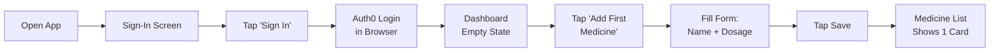
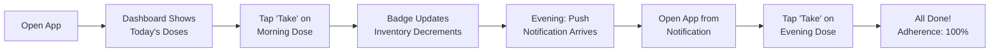
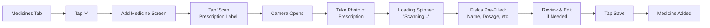
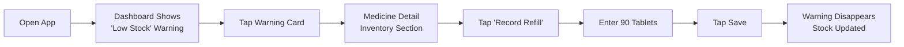
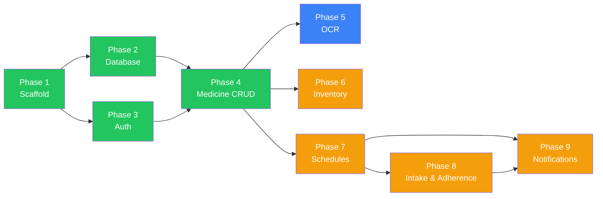

# Medicine Tracker — Product Specification

## Document Control

| Version | Date | Author | Changes |
|---------|------|--------|---------|
| 1.0 | 2026-03-08 | Principal PM | Initial spec covering Phases 1–4 (complete) and Phases 5–9 (planned). Full feature definitions, user journeys, acceptance criteria, risk register, and roadmap. |

**Status:** Living document — updated as each phase ships.
**Audience:** Product managers, designers, QA, engineers, and anyone driving spec-driven development on this product.
**Architecture companion:** [architecture.md](./architecture.md)

---

## 1. Product Vision

### 1.1 Problem Statement

Managing multiple prescriptions for a family is complex and error-prone. People forget doses, run out of medicines unexpectedly, and lose track of which family member takes what. Existing solutions fall into three unsatisfying categories:

1. **Hospital-grade systems** — too complex, designed for clinical staff, not families.
2. **Basic reminder apps** — only send alarms, with no inventory tracking or medicine detail management.
3. **Cloud-dependent apps** — require accounts and servers, raising privacy concerns about sensitive health data.

There is a gap for a **simple, private, family-friendly** medicine manager that works entirely on-device.

### 1.2 Vision Statement

Medicine Tracker is a mobile app that helps individuals and families manage their prescriptions with confidence. Each person uses their own account. All data stays on-device. The app reduces missed doses and surprise stockouts through smart reminders and inventory tracking — without ever sending health data to a server.

### 1.3 Value Proposition

| Pillar | What it means |
|--------|---------------|
| **Privacy** | All data lives on the device. No cloud storage. No data sharing. Health information never leaves the phone unless the user explicitly scans a prescription (OCR). |
| **Simplicity** | Add medicines manually in seconds or scan a prescription label with AI. No training needed. |
| **Reliability** | Daily dose reminders and low-stock alerts ensure nothing is forgotten. Adherence stats give users visibility into their habits. |
| **Family-friendly** | Each family member logs in with their own Auth0 account. One device can serve the whole family while keeping each person's data completely separate. |

### 1.4 Success Criteria

| Metric | Target |
|--------|--------|
| Time to add a medicine (manual) | Under 30 seconds |
| Time to add a medicine (OCR scan) | Under 10 seconds |
| Daily adherence visibility | Single-glance on dashboard |
| Missed refills | Zero with proactive low-stock warnings |

---

## 2. User Personas

### 2.1 Priya — Primary Persona

| Attribute | Detail |
|-----------|--------|
| **Age** | 35 |
| **Role** | Working mother |
| **Tech comfort** | Moderate — uses smartphone daily, comfortable with apps |
| **Medicines managed** | Herself (thyroid), her 8-year-old (allergies), her mother (diabetes + BP meds) |
| **Pain points** | Forgets her own evening dose due to busy work schedule. Runs out of her mother's BP meds because nobody tracks the bottle count. Confused about which family member takes what. |
| **Goals** | One app per family member. Quick daily check: "What do I need to take today?" Push notifications so she doesn't have to remember. Low-stock warnings before the bottle runs empty. |
| **Quote** | "I just need something that reminds me AND tells me when to refill." |

### 2.2 Raj — Secondary Persona

| Attribute | Detail |
|-----------|--------|
| **Age** | 62 |
| **Role** | Retired, lives alone |
| **Tech comfort** | Low — uses WhatsApp and phone calls, struggles with small text |
| **Medicines managed** | 4 daily medications (BP, cholesterol, diabetes, vitamins) |
| **Pain points** | Can't read the tiny text on prescription labels. Gets confused about which pill is the morning one vs. the evening one. Forgets whether he already took today's dose. |
| **Goals** | Large text and simple buttons. Scan the prescription label instead of typing. Clear "Take now" buttons on the dashboard. |
| **Quote** | "My daughter set it up for me. I just open it and tap the green button." |

### 2.3 Dr. Mehta — Edge Case / Future

| Attribute | Detail |
|-----------|--------|
| **Age** | 48 |
| **Role** | Family doctor |
| **Relationship to app** | Not a direct user. Influences requirements around dose history and reporting. |
| **Need** | Wants patients to bring adherence data to appointments. Would benefit from a "Print dose history" export feature. |
| **Quote** | "If my patients tracked their adherence, I could adjust their treatment plans with real data." |

---

## 3. Feature Inventory

| ID | Feature | Phase | Status | Priority | Personas |
|----|---------|-------|--------|----------|----------|
| F1 | App scaffold (routing, styling, config) | 1 | Done | P0 | All |
| F2 | SQLite database with full schema | 2 | Done | P0 | All |
| F3 | Auth0 login (OIDC + PKCE) | 3 | Done | P0 | Priya, Raj |
| F4 | Medicine CRUD (add / view / edit / archive) | 4 | Done | P0 | Priya, Raj |
| F5 | OCR prescription scanning (Claude API) | 5 | Planned | P1 | Raj (primary), Priya |
| F6 | Inventory tracking + low-stock alerts | 6 | Planned | P1 | Priya (primary) |
| F7 | Dosage schedules (times, frequency, days) | 7 | Planned | P1 | All |
| F8 | Intake logging + adherence statistics | 8 | Planned | P0 | All |
| F9 | Local push notifications (reminders) | 9 | Planned | P0 | Priya, Raj |

**Priority key:** P0 = must-have for v1.0 launch. P1 = high-value, planned for v1.0.

---

## 4. Feature Specifications

### 4.1 F1: App Scaffold (Phase 1 — Done)

**Description:** Project initialization with Expo SDK 55, TypeScript strict mode, expo-router file-based routing, NativeWind v4 for styling, and environment variable configuration.

**Acceptance Criteria:**
- [x] App builds and runs on iOS simulator and Android emulator via Expo Go.
- [x] File-based routing resolves correctly for all defined routes.
- [x] NativeWind `className` props render styled components.
- [x] `@/` path alias resolves in both app code and test files.
- [x] `.env` file structure defined with placeholder values.

---

### 4.2 F2: SQLite Database Layer (Phase 2 — Done)

**Description:** On-device SQLite database with 5 tables (medicines, schedules, intake_logs, inventory, notification_log), TypeScript interfaces, idempotent migrations, and performance indexes.

**Acceptance Criteria:**
- [x] `runMigrations(db)` creates all tables idempotently (`CREATE TABLE IF NOT EXISTS`).
- [x] Foreign keys enforced (`PRAGMA foreign_keys = ON`).
- [x] Cascading deletes configured (deleting a medicine removes related schedules/logs/inventory).
- [x] Indexes exist for common query patterns (user+active, user+date+status).
- [x] TypeScript interfaces in `schema.ts` match column definitions exactly.
- [x] Migrations run synchronously before first screen render.

---

### 4.3 F3: Authentication (Phase 3 — Done)

**Description:** Auth0 OIDC authentication with PKCE (no client secret). Session persistence via SecureStore. `AuthProvider` context with `useAuth()` hook available to all screens.

**User Stories:**
- As a user, I can sign in with email/password, Google, or Apple via Auth0 Universal Login.
- As a user, I remain logged in after closing and reopening the app (session restored from SecureStore).
- As a user, I can sign out and be returned to the login screen.
- As a user, I see a loading spinner while the app checks for an existing session on startup.

**Acceptance Criteria:**
- [x] PKCE flow completes without client secret.
- [x] Auth0 `sub` is extracted from the ID token JWT payload and stored as the primary user identifier.
- [x] Session restore from SecureStore works on app relaunch (user skips sign-in screen).
- [x] Logout clears both SecureStore entries and resets React state to `null`.
- [x] Redirect URI is correctly configured for Expo Go development environment.
- [x] `useAuth()` provides `{ user, isLoading, login, logout }` to all screens.

---

### 4.4 F4: Medicine Management (Phase 4 — Done)

**Description:** Full CRUD for medicines. List view with cards, detail view, add form with validation, edit form with pre-fill, and archive (soft delete).

**User Stories:**
- As a user, I can add a new medicine by entering name, dosage, and optionally instructions and doctor.
- As a user, I can view a list of all my active medicines sorted alphabetically.
- As a user, I can tap a medicine card to see its full details (name, dosage, instructions, doctor, date added).
- As a user, I can edit any field of an existing medicine.
- As a user, I can archive a medicine I no longer take, knowing its history is preserved.
- As a user, I see a helpful empty state with guidance when I have no medicines yet.
- As a user, I can pull down on the medicine list to refresh.

**Acceptance Criteria:**
- [x] Name and dosage are required fields; form shows alert if either is empty on save.
- [x] Instructions and doctor fields are optional.
- [x] Archived medicines (`is_active = 0`) disappear from the list but remain in the database.
- [x] Archive action requires confirmation via native alert dialog.
- [x] Pull-to-refresh triggers data re-fetch from SQLite.
- [x] Every database operation is scoped to the logged-in user's `user_id`.
- [x] Medicine list uses `FlatList` for virtualized scrolling performance.
- [x] Empty state shows pill emoji, guidance text, and "Add First Medicine" button.

---

### 4.5 F5: OCR Prescription Scanning (Phase 5 — Planned)

**Description:** Use the device camera or photo library to photograph a prescription label. Send the image to Claude API (claude-haiku-4-5) which extracts medicine name, dosage, instructions, and doctor. Pre-fill the add-medicine form with the extracted data. The user always reviews before saving.

**User Stories:**
- As a user, I can tap "Scan Prescription Label" on the add-medicine screen to open the camera.
- As a user, I can choose to take a new photo or select an existing one from my photo library.
- As a user, I see a loading indicator while the AI processes my image.
- As a user, I see the extracted fields pre-filled in the form and can correct any errors before saving.
- As a user, I see a clear error message if the scan fails (network error, unreadable image, API error).
- As a user, I can dismiss the error and still add the medicine manually.

**Acceptance Criteria:**
- [ ] Camera permission is requested with a clear, user-friendly explanation message.
- [ ] Photo library permission is requested with a clear explanation message.
- [ ] Image is sent as base64 to the Claude API endpoint.
- [ ] API response is parsed into `AddMedicineInput` fields: `name`, `dosage`, `instructions`, `doctor`.
- [ ] Extracted fields pre-fill the form — user reviews and edits before tapping Save.
- [ ] OCR **never auto-saves** — the user must explicitly confirm.
- [ ] Network errors show: "Could not connect. Check your internet and try again."
- [ ] API errors show: "Could not read the label. Try a clearer photo or enter details manually."
- [ ] Unparseable responses show: "Could not find medicine details in this image."
- [ ] Works with both camera capture and photo library selection.
- [ ] Loading state shows a spinner with "Scanning prescription..." text.

---

### 4.6 F6: Inventory Tracking (Phase 6 — Planned)

**Description:** Track quantity on hand for each medicine. Set a low-stock threshold. Show warnings on the medicine card and dashboard when stock is running low.

**User Stories:**
- As a user, I can set the current quantity and unit (tablets, ml, capsules, patches) for a medicine.
- As a user, I can set a low-stock threshold (e.g., "warn me when below 7 tablets").
- As a user, I see a warning badge on a medicine card when it is running low.
- As a user, I can record a refill (set new quantity and refill date).
- As a user, I see the last refill date on the medicine detail screen.
- As a user, I see a dashboard summary of all low-stock medicines.

**Acceptance Criteria:**
- [ ] Inventory section appears on the medicine detail screen (`/medicine/[id]`).
- [ ] Default unit is "tablet"; user can change to ml, capsule, or patch.
- [ ] Default low-stock threshold is 7 (approximately one week's supply).
- [ ] Quantity supports decimals (e.g., 0.5 for half-tablets, 12.5 ml).
- [ ] Low-stock badge (e.g., amber warning icon) appears on `MedicineCard` when `quantity_on_hand <= low_stock_threshold`.
- [ ] Dashboard shows a "Low Stock" section listing all medicines below threshold.
- [ ] Recording a refill updates `quantity_on_hand` and sets `last_refill_date`.
- [ ] Inventory auto-decrements when a dose is marked as taken (Phase 8 integration).
- [ ] One inventory row per medicine (enforced by UNIQUE constraint on `medicine_id`).

---

### 4.7 F7: Dosage Schedules (Phase 7 — Planned)

**Description:** Define when each medicine should be taken. Support daily, twice daily, weekly, and as-needed frequencies. Support specific times of day and specific days of the week.

**User Stories:**
- As a user, I can set a schedule for a medicine (e.g., "daily at 8:00 AM and 8:00 PM").
- As a user, I can choose a frequency: daily, twice daily, weekly, or as needed.
- As a user, I can specify which days of the week for weekly medicines (e.g., Monday, Wednesday, Friday).
- As a user, I can edit an existing schedule.
- As a user, I can deactivate a schedule without deleting it.

**Acceptance Criteria:**
- [ ] Schedule section appears on the medicine detail screen.
- [ ] Time picker allows selecting HH:MM for each dose time.
- [ ] Frequency options: `daily`, `twice_daily`, `weekly`, `as_needed`.
- [ ] For `weekly` frequency, a day-of-week selector appears (multi-select: Mon–Sun).
- [ ] For `daily` and `twice_daily`, `days_of_week` is stored as `null` (meaning every day).
- [ ] For `as_needed`, no specific times are required (user takes doses ad-hoc).
- [ ] Times are stored as a JSON array in `times_of_day` (e.g., `'["08:00","20:00"]'`).
- [ ] Deactivating a schedule sets `is_active = 0` (soft deactivation).
- [ ] Each schedule is scoped to `user_id`.

---

### 4.8 F8: Intake Logging & Adherence (Phase 8 — Planned)

**Description:** Generate pending dose entries from active schedules. Let the user mark each dose as "Taken" or "Skipped" with one tap. Calculate and display adherence statistics.

**User Stories:**
- As a user, I see today's pending doses on the dashboard with clear "Take" and "Skip" buttons.
- As a user, I can mark a dose as taken with one tap, and it records the exact time.
- As a user, I can mark a dose as skipped and optionally add a note (e.g., "felt nauseous").
- As a user, I can see my weekly adherence percentage on the dashboard.
- As a user, I can see per-medicine adherence over time on the medicine detail screen.
- As a user, I can see a history of all doses taken and skipped.

**Acceptance Criteria:**
- [ ] Pending `intake_log` rows are generated from active schedules for the current day.
- [ ] "Taken" sets `status = 'taken'` and `taken_at` to current timestamp.
- [ ] "Skipped" sets `status = 'skipped'`; `taken_at` remains null.
- [ ] Optional notes field appears after tapping "Skip".
- [ ] Adherence percentage = (taken count / total count) * 100 for a given period.
- [ ] Dashboard becomes the primary daily dose tracking screen (major UI rework of `dashboard.tsx`).
- [ ] Dashboard groups doses by time of day (morning, afternoon, evening).
- [ ] Per-medicine adherence displayed on the medicine detail screen.
- [ ] Marking a dose as taken decrements inventory by 1 unit (Phase 6 integration).
- [ ] Past-due doses (older than today) are auto-marked as "skipped" or shown as overdue.

---

### 4.9 F9: Local Push Notifications (Phase 9 — Planned)

**Description:** Schedule local push notifications at each dose time. Cancel notifications when doses are marked as taken. Also notify for low-stock alerts.

**User Stories:**
- As a user, I receive a push notification at each scheduled dose time saying which medicine to take.
- As a user, the notification includes the medicine name and dosage (e.g., "Time to take Lisinopril 10mg").
- As a user, if I mark a dose as taken, the notification for that dose is cancelled.
- As a user, I receive a notification when a medicine's stock drops below the low-stock threshold.
- As a user, I can disable notifications per medicine in the future (settings enhancement).

**Acceptance Criteria:**
- [ ] Notification permission is requested with a clear explanation ("We'll remind you when it's time to take your medicine").
- [ ] Notifications are **local only** — no server push infrastructure.
- [ ] Notification IDs are stored in `notification_log` for cancellation.
- [ ] Each scheduled notification includes: medicine name, dosage, and dose time.
- [ ] Cancelling a notification removes the entry from `notification_log`.
- [ ] Low-stock notifications fire once when quantity drops below threshold (not repeatedly).
- [ ] Notifications respect the schedule — correct times and correct days.
- [ ] App gracefully degrades if notification permission is denied (in-app dose list still works).
- [ ] Notifications are re-scheduled on app launch (handles device restart/app update scenarios).

---

## 5. User Journeys

### 5.1 First-Time Setup

**Estimated time:** Under 2 minutes from install to first medicine saved.

### 5.2 Daily Usage (Phase 8+)

### 5.3 OCR Scan (Phase 5)

### 5.4 Restock (Phase 6)

---

## 6. Non-Functional Requirements

### 6.1 Performance

| Metric | Target |
|--------|--------|
| Cold start to interactive | Under 3 seconds |
| Medicine list render (up to 50 medicines) | Under 500ms |
| SQLite query latency | Under 10ms (synchronous, local storage) |
| OCR API round-trip | Under 5 seconds (depends on network + image size) |

### 6.2 Reliability

| Requirement | Detail |
|-------------|--------|
| Offline operation | App works fully offline except for login (Auth0) and OCR (Claude API). |
| Data persistence | SQLite database file persists across app updates. |
| Migration safety | Migrations are idempotent — safe to re-run. |
| Crash recovery | SQLite uses WAL mode by default — survives mid-write crashes. |

### 6.3 Security

| Requirement | Detail |
|-------------|--------|
| Token storage | OS-level encrypted storage (iOS Keychain / Android EncryptedSharedPreferences). |
| Data isolation | All database queries scoped to `user_id`. |
| Network data | No user data transmitted to any server except prescription images for OCR (not stored server-side). |
| Input sanitization | Parameterized SQL queries (`?` placeholders) prevent injection. |

### 6.4 Accessibility

| Requirement | Detail |
|-------------|--------|
| Touch targets | Minimum 44x44 pt (already met with current button sizes). |
| Dynamic Type | Support iOS Dynamic Type scaling (future enhancement). |
| Color contrast | Meet WCAG 2.1 AA for all text/background combinations. |
| Screen reader | Ensure all interactive elements have accessible labels (future audit). |

### 6.5 Scalability (On-Device)

| Dimension | Capacity |
|-----------|----------|
| Medicines per user | Up to 100 |
| Intake logs per medicine | Up to 1 year (~730 rows for twice-daily) |
| Total database size | Under 10 MB for typical usage |
| SQLite performance | Easily handles these volumes with proper indexing |

### 6.6 Platform Support

| Platform | Minimum Version |
|----------|-----------------|
| iOS | 15.0+ (Expo SDK 55 requirement) |
| Android | API 24 / Android 7.0+ |
| Web | Not planned for v1.0 |

---

## 7. Risk Register

| ID | Risk | Impact | Probability | Mitigation |
|----|------|--------|-------------|------------|
| R1 | Anthropic API key exposed in app binary | High (abuse, billing) | Medium | Use backend proxy before production. Acceptable for dev/learning. |
| R2 | Auth0 token expires without refresh logic | Medium (user logged out unexpectedly) | Medium | Implement token refresh in AuthContext. Currently, session restore covers most cases. |
| R3 | OCR misreads prescription fields | Medium (wrong medicine added) | High | Always require user review before save. Never auto-save from OCR results. |
| R4 | SQLite data lost on app uninstall | High (all history gone) | Certain (by OS design) | Document limitation clearly. Future: add export/backup feature. |
| R5 | Deep link bypasses auth check | Low (data still scoped by user_id) | Low | Add route-level auth guard to `(tabs)/_layout.tsx`. |
| R6 | No multi-device sync | Medium (data stuck on one phone) | N/A (by design) | Accept for v1. Future: optional cloud sync backend. |
| R7 | Notification permission denied by user | Medium (reminders don't work) | Medium | Graceful degradation — in-app dose list still functions. Show in-app prompt explaining benefit. |
| R8 | Large notification volume overwhelms OS scheduler | Low (OS may drop notifications) | Low | Batch-schedule notifications in 7-day windows. Re-schedule weekly. |

---

## 8. Success Metrics / KPIs

### 8.1 Engagement Metrics

| Metric | Definition | Target |
|--------|-----------|--------|
| Daily Active Users (DAU) | Unique users who open the app per day | User opens app at least once daily |
| Medicines per user | Average count of active medicines | 3–5 per user |
| Dose interaction rate | % of pending doses the user taps Take or Skip (vs. ignoring) | > 90% |

### 8.2 Outcome Metrics

| Metric | Definition | Target |
|--------|-----------|--------|
| Weekly adherence rate | (Taken doses / Total scheduled doses) * 100 | > 85% |
| Stockout events | Times a medicine hits 0 quantity without prior refill | 0 per month |
| Time to add a medicine (manual) | Seconds from tapping "+" to tapping "Save" | < 30 seconds |
| Time to add a medicine (OCR) | Seconds from tapping "Scan" to tapping "Save" | < 10 seconds |

### 8.3 Quality Metrics

| Metric | Definition | Target |
|--------|-----------|--------|
| Crash rate | Crashes per 1,000 sessions | < 1% |
| OCR accuracy | % of scanned fields that are correct without user editing | > 80% |
| Unit test coverage (service layer) | Lines covered by vitest | > 80% |

---

## 9. Roadmap

### 9.1 Phase Timeline

| Phase | Feature | Dependencies | Status |
|-------|---------|--------------|--------|
| 1 | App scaffold + routing | None | Done |
| 2 | SQLite database layer | Phase 1 | Done |
| 3 | Auth0 authentication | Phase 1 | Done |
| 4 | Medicine CRUD UI | Phase 2, Phase 3 | Done |
| 5 | OCR prescription scanning | Phase 4 | Next |
| 6 | Inventory tracking | Phase 4 | Planned |
| 7 | Dosage schedules | Phase 4 | Planned |
| 8 | Intake logging + adherence | Phase 7 | Planned |
| 9 | Push notifications | Phase 7, Phase 8 | Planned |

### 9.2 Phase Dependency Graph

**Legend:** Green = Done. Blue = Next. Amber = Planned.

**Key insight:** Phases 5, 6, and 7 are **independent of each other** and can be built in parallel after Phase 4. Phase 8 requires Phase 7 (schedules generate pending doses). Phase 9 requires both Phase 7 and Phase 8 (notifications tied to schedules and intake).

### 9.3 Beyond v1.0 (Future Consideration)

These features are not planned for v1.0 but represent natural evolution paths based on user personas and market analysis:

| Feature | Persona Impact | Complexity |
|---------|---------------|------------|
| Multi-device sync (cloud backend) | High — Priya manages medicines across phone and tablet | High (requires backend: Supabase/Firebase/custom) |
| Family sharing / caregiver view | High — Priya manages her mother's medicines | Medium |
| Medication interaction checker | Medium — safety feature for users on multiple drugs | Medium (requires drug interaction API) |
| Export dose history as PDF | Medium — Dr. Mehta wants patients to bring data | Low |
| Apple Health / Google Fit integration | Low — nice-to-have for health enthusiasts | Medium |
| Pharmacy refill ordering | Medium — reduces friction for Priya | High (requires pharmacy API partnerships) |
| Home screen widget | Medium — Raj wants one-glance status | Medium (requires native widget code) |

---

## Appendix A: Glossary

| Term | Definition |
|------|-----------|
| **Adherence** | The percentage of scheduled doses that were actually taken. 100% adherence = no missed doses. |
| **Archive / Soft delete** | Hiding a medicine from the active list by setting `is_active = 0`. The data remains in the database for history. |
| **Auth0** | A third-party identity provider. Handles login forms, password storage, social login (Google/Apple). |
| **CRUD** | Create, Read, Update, Delete — the four basic database operations. |
| **Expo** | A framework and platform for building React Native apps. Provides managed native modules. |
| **JWT** | JSON Web Token — a signed token containing user identity claims (sub, email, name). |
| **OCR** | Optical Character Recognition — extracting text from images. In this app, used to read prescription labels. |
| **OIDC** | OpenID Connect — an identity layer on top of OAuth 2.0. Used for authentication. |
| **PKCE** | Proof Key for Code Exchange — a security mechanism for OAuth in mobile apps that can't store secrets. |
| **SecureStore** | Expo's encrypted key-value storage. Uses iOS Keychain and Android EncryptedSharedPreferences. |
| **Soft delete** | See "Archive." |
| **SQLite** | A lightweight, file-based relational database. Runs on-device with no server. |
| **Sub** | The `sub` (subject) claim in a JWT — a unique identifier for the user (e.g., `"auth0\|abc123"`). |
